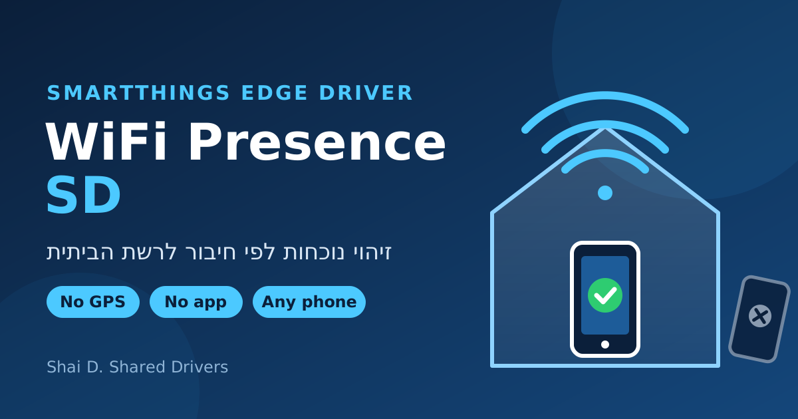

# WiFi Presence SD

SmartThings Edge driver. Install from the **Shai D. Shared Drivers** channel: [Join the channel](https://bestow-regional.api.smartthings.com/invite/Q1jP7By0KVlL)

Phone presence detection by home WiFi. The hub checks whether each family member's phone is connected to the home network. No GPS, no app on the phone, no Tasker. Runs locally on the hub.

## Supported Devices

Any phone (Android or iPhone) on the same home network (subnet) as the hub. Multiple SSIDs on the same router (2.4G / 5G / extenders) are supported. Added via LAN scan (Add device → Scan nearby).

## Setup

1. Install the driver from the channel, then **Add device → Scan nearby**. A device named "WiFi Presence 1" is created. Rename it (e.g. "Dana's phone").
2. On the phone, use a **fixed MAC address** on every home network:
   - Samsung: WiFi → ⚙ next to the network → View more → MAC address type → **Phone MAC**
   - iPhone: WiFi → ⓘ next to the network → Private Wi-Fi Address → **Off**
3. **Learn the phone:**
   1. Turn the phone's WiFi **off**.
   2. Turn **Learn phone** on.
   3. Wait for **"Turn WiFi ON now"**, then turn WiFi on.
   4. When **"Got .xxx"** appears, switch to the next home network (if any).
   5. Turn **Learn phone** off when done (it also stops after 4 minutes with nothing new).
4. Scan again to add the next family member.

## Device view

- **Presence** – Present / Not present (usable in Routines like any presence sensor)
- **Learn phone** – starts / stops a learn session
- **Learn status** – what to do next during learning
- **Learned IPs** – the phone's learned addresses (up to 6)

## Settings

| Setting | Description |
|---|---|
| Phone IP (optional) | Manual IP(s), comma-separated. Leave `0.0.0.0` to use learned IPs |
| Check every (seconds) | Poll interval, default 30 |
| Away after (minutes offline) | Delay before "Not present", default 10 |
| Clear learned IPs | Turn on, then off, to erase all learned IPs |
| Ignore IPs during Learn | Other devices that interfere with learning, e.g. `192.168.1.100` |
| IP labels | Name each IP, e.g. `119=2.4G, 136=5G` |

## How it works

- Every poll, the hub opens a TCP connection to each learned IP. A reply (or "connection refused") means the phone is on the network.
- Arrival is detected within about 30 seconds. "Not present" is set only after the away delay, to avoid false away while a phone sleeps.
- Learn scans the subnet with the phone's WiFi off, then detects the new device that appears when WiFi is turned on.

## Custom capabilities

Namespace `perfectworld33337`: `learnedIps`, `learnStatus` (definitions and presentations in `capabilities/`).
